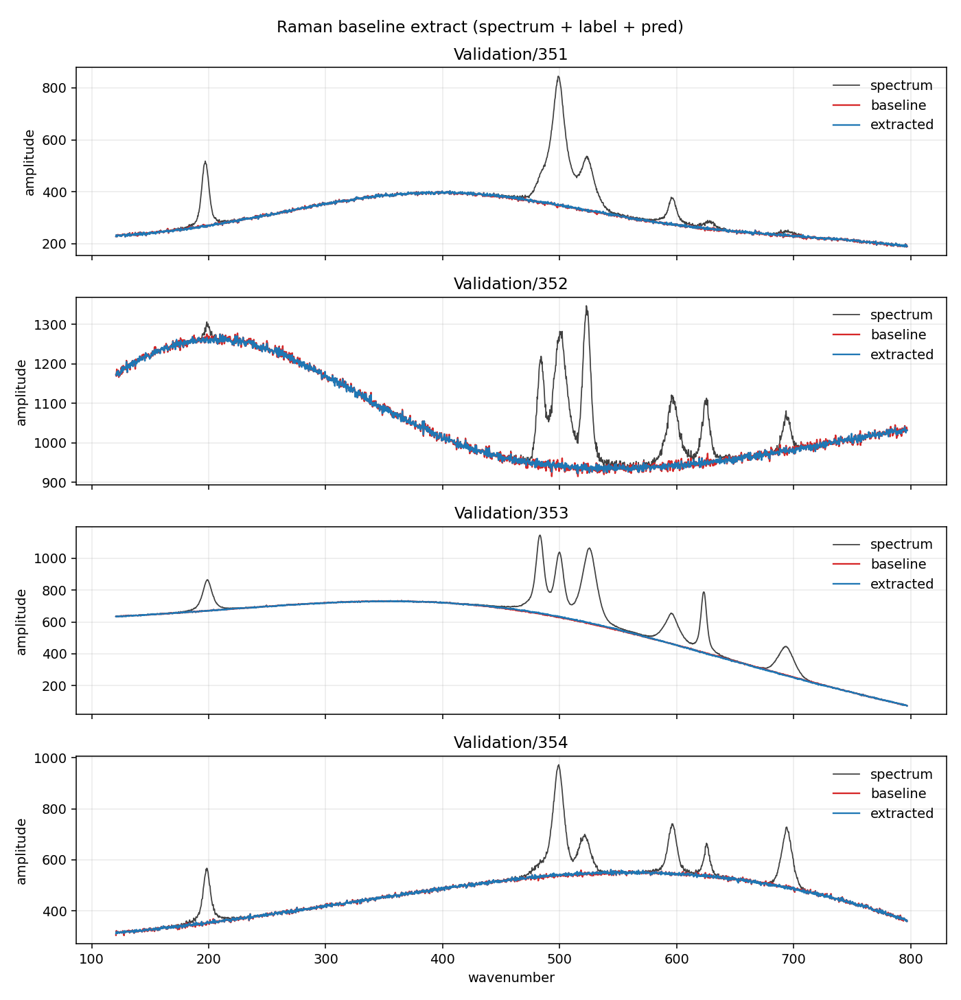

# Raman Baseline Extraction

## Definitions

| Symbol / term | Meaning |
|---------------|---------|
| LCN | Locally Connected Network: the trained hypercube, class `Core` + `Training`. |
| dim | Hypercube dimension. This example uses 11. |
| N | Vertex count, N = 2ᵈⁱᵐ = 2048. Spectrum length and field length. |
| z_max | Depth count. This example uses 8. |
| span, gather_span | Lookback window width. This example uses 4. |
| RMSE | Root mean squared error in raw counts after denormalization. |
| LCOHard | The Raman dataset split: 10000 training spectra, 2000 held-out. |

A Raman spectrum is an array of intensity values: sharp molecular
peaks sitting on a slow fluorescence background. The task is to
characterize that background so that it can, in follow-on steps, be
subtracted from the original spectrum, leaving only Raman peaks and
random noise remaining. That extraction is the part conventional
methods fail, often miserably, at. Polynomials, asymmetric least
squares, and ordinary convolutional nets follow the empty stretches
and then ride up into the vibrational excitation bands or cut a hole
under them.

This example runs the LCN (Locally Connected Network) on that task,
and unlike its fixed-preprocessor siblings it brings no preprocessor
at all: the
hypercube itself is the model, and every weight in it is trained. The
cube is the same length as the spectrum (`N = 2048`, dim 11), so a
spectrum is already a field and there is nothing to pack. Eight
depths rewrite that field in place, each vertex mixing a span-4
window of its neighbors' recent history through its own private
weight table, and the last depth writes its sum raw — a baseline in
counts is not confined to (-1, 1). The forward pass is
[docs/forward.md](../../docs/forward.md); the backward pass that
gives the 720 896 weights their values is
[docs/training.md](../../docs/training.md).

Train with `lcn_raman`, write selected spectra with
`lcn_raman_extract`, plot with `plot_extracted.py`.

---

## Results

**Status: Release run of `lcn_raman`. The table was produced before the weight layout changed (1.2.0); the same seed now draws a different net, so a re-run gives different numbers with the same picture.**

Full LCOHard split — 10000 training spectra, 2000 held-out validation
spectra. Denormalized RMSE in raw counts (see [Error](#error)).

| Split | RMSE |
|-------|-----:|
| Training | 1.978 |
| Validation | 2.028 |

The validation score sits 0.05 counts above training. That gap is
worth a pause: this network has 720 896 trainable weights fit on
10000 spectra — every vertex its own table, nothing shared — and the
classical expectation for a model that oversized is memorization.
It does not happen. The gradient only ever reaches a weight through
the same sparse gather every spectrum flows through, and that
discipline, not a small parameter count, is what keeps the fit
honest.

Run details, from the run that produced those numbers:

- 100 epochs, batch 48, `lr` 0.005 on a cosine schedule down to
  `lr_min_frac` 0.05, `restore_best` on. Best epoch was **99 of
  0–99** — the last one. The score was still creeping down when the
  run ended (2.038 at epoch 98, 2.028 at 99), so this floor is not a wall.
- Train time 22 m 23 s, single-threaded. (Training has since gone
  data-parallel — `kThreads` in
  [BaselineExtractor.h](BaselineExtractor.h) — so current builds run
  several times faster; reruns match these scores approximately, not
  bit-for-bit, because gradient summation order changed.)
- Weights saved to `C:/HypercubeLCN/RamanModels/lcn11.w`,
  reloaded into a fresh network, and checked against the original on
  a probe spectrum before the file is trusted.

## The trained cube vs the fixed preprocessors

The sibling repositories ran this exact task — same LCOHard splits,
same normalization, same RMSE in counts — with the opposite design:
a fixed random preprocessor (an etalon transit, a reservoir orbit, or
the two in series) feeding a small trained readout of one conv layer
and one channel. Their scores, from the
[HypercubeCascade example](https://github.com/dliptak001/HypercubeCascade/blob/main/examples/RamanBaselineExtraction/README.md):

| Host | What is trained | Training | Validation |
|------|-----------------|---------:|-----------:|
| HypercubeEtalon | readout only | 4.705 | 4.767 |
| HypercubeCascade | readout only | 4.779 | 4.819 |
| HypercubeWTF | readout only | 4.714 | 4.756 |
| **HypercubeLCN** | **everything** | **1.978** | **2.028** |

The three fixed-preprocessor hosts landed within 0.06 counts of one
another — a shared floor near 4.8 that no choice of preprocessor
moved. Training the cube itself cuts that floor to well under half.

The price is the gradient itself: the siblings fit one small readout,
while this run backpropagated through eight depths of the cube for
100 epochs. On this task the price was modest — 22 minutes when this
run was recorded, several-fold less under the now-default
data-parallel training.

This is not the floor either. A dim-12 cube carrying the same
2048-wide IO — half its vertices free hidden units — reaches **1.688**
validation on this task; that experiment is
[RamanBaselineNarrowIO](../RamanBaselineNarrowIO/README.md).

---

## The extracts

Aggregate RMSE says the fit is good; the only way to see *where* it
is good is to look. The overlay below is four held-out spectra,
Validation/351–354. Grey is the raw spectrum, red is the true
baseline, blue is the extract.



Each panel is a different way to fail, declined. On 351 the baseline
is a smooth hump and the peaks are tall and isolated: the extract
rides the hump straight through the peak cluster at 500–630 without
lifting. On 352 the baseline itself is noisy — the red trace has
visible texture — and the extract reproduces that texture while
staying flat under the dense band near 500, where a spline would sag
into the gap between peaks. On 353 the baseline is nearly noiseless
and falls off steeply past 500; red and blue are one line, through
the peaks and down the slope. On 354 the crest of the hump sits
directly under the peak cluster, the classic trap for asymmetric
least squares, and the extract holds the crest. At two counts of
RMSE the residual is at the scale of the label's own noise, and it
shows: there is almost no red visible anywhere.

`lcn_raman_extract` writes the predictions (its knobs — split,
indices, output directory — are constants at the top of
[lcn_raman_extract.cpp](lcn_raman_extract.cpp)), and
[plot_extracted.py](plot_extracted.py) reads the manifest the
extractor leaves behind, so there is no second index list to keep in
sync.

---

## Dataset on disk

Fixed root (read in place, not copied by the programs; download and
install steps in [examples/README.md](../README.md)):

```text
C:\HypercubeAI\data\RamanSpectraLCOHard\
  Training\
  Validation\
```

| Split | Patterns | Index range |
|-------|----------|-------------|
| Training | 10000 | `0` … `9999` |
| Validation | 2000 | `0` … `1999` |

Each pattern `X` is three files. Both splits also have one shared axis file.

```text
X.data.txt      input spectrum
X.label.txt     ground-truth baseline (train / score target)
X.peaks.txt     ignore for now
xaxis.txt       2048 wavenumbers; used only to label the plot's x axis
```

Indices are contiguous. Training and validation reuse the same numeric names
in their own folders; they are different spectra.

---

## Host knobs

`MakeCoreConfig()` and `MakeTrainConfig()` in
[BaselineExtractor.h](BaselineExtractor.h). The values behind the
results above:

| Knob | Value |
|------|-------|
| Cube | dim 11, N = 2048 |
| Depths | z_max 8, gather_span 4, tanh_last off, seed 934791766227647176 |
| Weights | 720 896 floats (z_max × N × dim × span) |
| Training | 100 epochs, batch 48, Adam (β1 0.9, β2 0.999, ε 1e-8) |
| Schedule | lr 0.005, cosine to lr_min_frac 0.05 over the full run, restore_best on |

Two of those deserve a word. `z_max = 8` is less than the cube's
diameter of 11: the run buys eight neighbor-hops of reach, enough for
information to cross most of the spectral line, without paying for
the last three. And span 4 with eight depths means about 19 % of the
weight table is dead — taps that land in the history stack's zero
prefix and stay frozen at their random initial values
([forward.md](../../docs/forward.md) works out why that costs nothing
but memory).

---

## File format

- One line, no header.
- 2048 comma-separated ASCII floating-point amplitudes.
- Same count in `.data`, `.label`, `.peaks`, and `xaxis.txt`.

---

## Scale

Per-spectrum min/max from the **input**, never the label, mapped to
**[-1, 1]**:

```text
range = max - min
u     = (x - min) / range
norm  = 2 * u - 1
x     = (norm + 1) * 0.5 * range + min

If the spectrum is flat, range is 0, norm is 0, and denorm is min.
```

The label uses the **same** min/range as its matching `.data` spectrum, not
its own min/max. Predict only has the input, so the scale has to come from
there.

Training sees only these normalized values — that is the
`train_loss (norm)` column of the epoch log. `Predict` denormalizes
before it returns, which is why the other column, `eval_rmse`, is in
counts.

---

## Error

Score is **RMS** of the denormalized prediction vs raw `X.label.txt`.
No curve fit.

Per spectrum, over the 2048 bins:

```text
err[i]  = label[i] - predicted[i]
RMSE    = sqrt( mean( err[i]^2 ) )
```

On a split (train prefix or validation prefix), take the mean of those
per-spectrum MSEs, then sqrt — same as RMSE over every bin in the split.

That is the number this example reports. Each epoch line prints it
over the 2000-spectrum eval pack; after training, the same score is
printed on the full train and validation splits. Peaks and
percent-of-peak error are out of scope.
