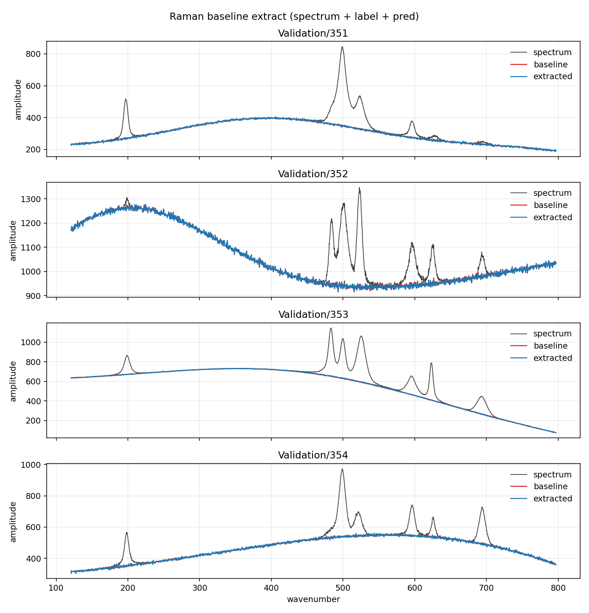

# Raman Baseline Extraction, Narrow IO

The [dim-11 baseline](../RamanBaseline/README.md) has a
peculiar symmetry: input, output, and every unit of computation share
the same 2048 vertices. There are no hidden units except across depth.
This example breaks that symmetry to test one thesis: **a cube wider
than its IO is trainable too.**

The cube here is dim 12 — 4096 vertices — but the IO stays 2048 wide.
The spectrum occupies addresses `0 … 2047` (the bit-11 = 0 subcube;
any other choice of fixed bit is the same network under relabeling),
and the prediction is read back from those same addresses. The other
2048 vertices are fed zeros on input and owe nothing to the loss —
they are the network's first genuinely free hidden units, reachable
from the IO subcube through one bit-11 hop per vertex.

Two mechanics make this work, both small:

- The input field is zero-padded from 2048 to 4096 before `Forward`,
  and the first 2048 values of the output are gathered after.
- The loss is masked: `Training::Loss(target, count)` seeds gradient
  only at the IO vertices, so the free half is trained by nothing but
  its usefulness to them. Without the mask, zero-padding the *target*
  would train the free half to output zero — hidden units demoted to
  constrained outputs, which is a different (and weaker) thesis.

Everything else is deliberately identical to the baseline: same data,
same splits, same normalization and scoring, same depth (`z_max = 8`),
span (4), seed, schedule, epochs (100), and batch (48). The weight
count doubles-and-a-bit to 1 572 864 (8 × 4096 × 12 × 4) — the extra
factor is the twelfth axis — and each forward pass costs about 2.2×
the baseline's. The only variable under test is the extra capacity.

Train with `lcn_raman_narrow` (weights land at
`C:/HypercubeLCN/RamanModels/narrow12.w`), write selected
spectra with `lcn_raman_narrow_extract`, plot with this folder's
`plot_extracted.py` (it reads `extracted_narrow` and writes
`extracted_baselines_narrowIO.png`).

## Results

The thesis holds, with room to spare. Full LCOHard split, denormalized
RMSE in counts, against the dim-11 baseline's numbers:

| Cube | IO | Training | Validation |
|------|----|---------:|-----------:|
| dim 11, N = 2048 | every vertex | 1.978 | 2.028 |
| **dim 12, N = 4096** | **2048 of 4096** | **1.636** | **1.688** |

Not merely trainable — 17 % better. The zero-fed, loss-free half of
the cube earns its keep: the run crossed the baseline's final floor
of 2.028 at epoch 66 and spent the remaining third of the schedule
pulling away. A free hidden vertex, it turns out, is worth more than
an input-burdened one.

Run details, from the run that produced those numbers:

- Same 100 epochs, batch 48, lr 0.005 cosine to 5 %, `restore_best`
  on. Best epoch was **99 of 0–99** — the last, still descending
  (1.702 at epoch 98, 1.688 at 99). Like the baseline, this floor is
  a budget, not a wall.
- The eval pack is the entire 2000-spectrum validation split, so the
  per-epoch metric and the final validation RMSE are the same number.
- The train/validation gap is 0.05 counts — the same gap the baseline
  had. Doubling the weight count to 1 572 864 (157 per training
  spectrum) moved both scores down together and widened the gap not
  at all; the sparse gather keeps disciplining the fit.
- Train time 1 h 37 m, single-threaded — 4.3× the baseline's 22 m,
  against the 2.2× the operation count predicts. The weight table
  grew from 2.9 MB to 6.3 MB; the difference is likely the cache's
  opinion of that. (Training has since gone data-parallel — `kThreads`
  in [BaselineExtractor.h](../RamanBaseline/BaselineExtractor.h) — so
  current builds run several times faster; reruns match these scores
  approximately, not bit-for-bit.)
- Weights saved to `C:/HypercubeLCN/RamanModels/narrow12.w`.

The oscillation visible mid-run (upticks of 0.3–0.5 counts, e.g.
2.73 → 3.30 around epoch 37) is the same stochastic bounce the
baseline showed while the learning rate was near peak, and it damped
on the same schedule: from epoch ~85 the score moved a hundredth at a
time. `restore_best` makes the bounce harmless either way.

## The extracts

The same four held-out spectra as the
[baseline's figure](../RamanBaseline/README.md#the-extracts),
Validation/351–354, for a direct side-by-side. Grey is the raw
spectrum, red is the true baseline, blue is the extract.

The story at 1.7 counts is that there is no story left to see: the
red trace is buried under the blue in every panel — through the peak
clusters of 351 and 354, along 352's noisy trough, down 353's steep
flank. The baseline's figure already showed only hairlines of red;
here even those are gone. The remaining third of a count between the
two runs lives below what an overlay at this scale can resolve, which
is the right problem to have.
